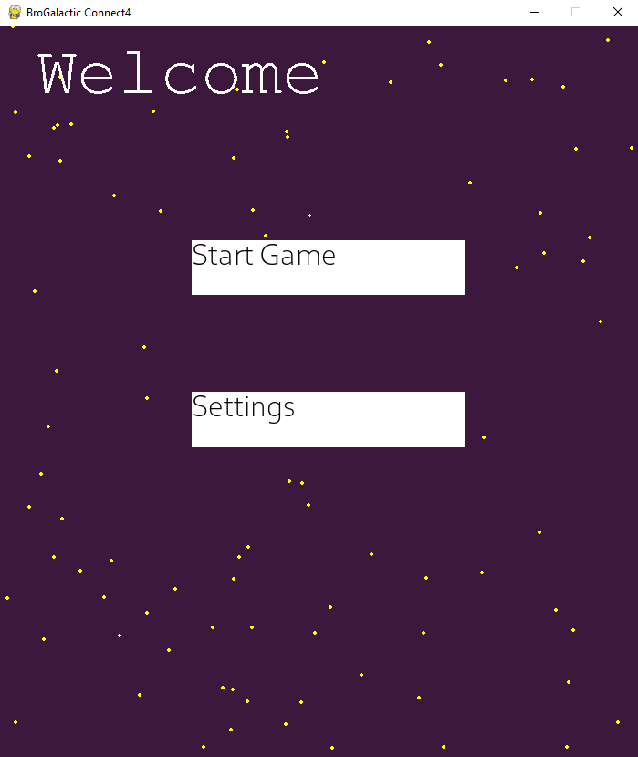
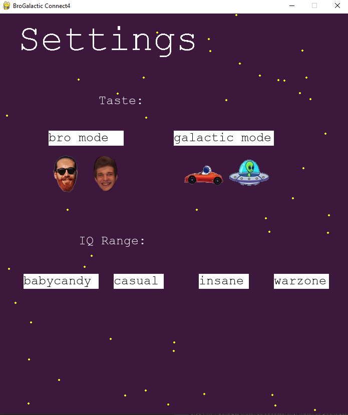

# BroGalacticConnect4
Python-based version of the Connect Four Game
- University awarded project

## Used Conceps:
  - Pygame
  - Layered Architecture
  - AI Computer Moves (minimax algorithm)
  - Console User Interface
  - Graphical User Interface
  - Unittests (90% service / domain coverage)
  
 ## Functionalities and Experience Details
  
  - Multiple Themes
  - Multiple Difficulties
  - Animations
  - Background sound
  
 ## Demo:
  Graphical User Interface:
  
  - main menu window
  - 
  
  - settings window
  - 

  - transition to the game
  - 
  
  - game window with the galactic theme
  - 

  - transition to the game (when bro theme selected)
  - 

  - game window with the bro theme (when the bro theme is selected)
  - 

  Console User Interface:
  
  - main menu + settings
  - 

  - the start of the gameplay
  - 

  - the end of the gameplay
  - 
  
 
